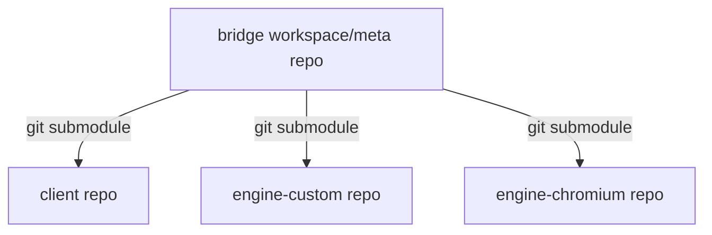
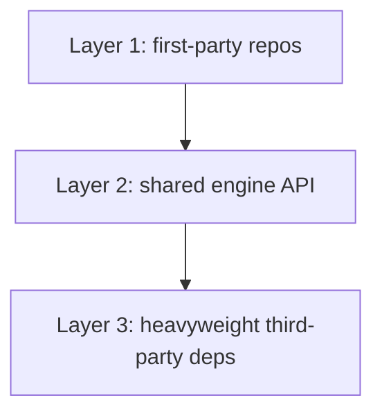
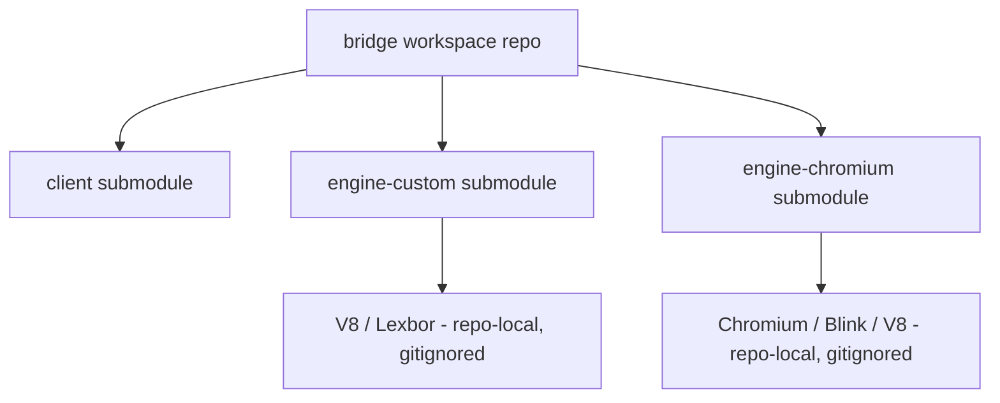

# GIT.md

# bridge source-code and dependency management plan

This document defines the intended repository topology, dependency ownership, and Git/submodule strategy for the Bridge architecture.

## Repository set

We want 4 repositories total:

1. `bridge/` — thin workspace/meta repo
2. `client/` — app/client repo
3. `engine-custom/` — custom engine repo
4. `engine-chromium/` — Chromium-backed engine repo

## Recommended topology

The root `bridge/` repo should track the three child repos as sibling submodules.

## Why the root workspace repo should own the submodules

This matches the real architecture:
- `client` is the application/client layer
- `engine-custom` and `engine-chromium` are peer engine backends
- the root repo is orchestration only

We explicitly do **not** want:
- `client` to become the parent repo that owns the engines as child submodules

That would misrepresent the intended peer relationship.

## What each repo owns

### `bridge/`
Owns:
- `.gitmodules`
- workspace docs (`README.md`, `WORKSPACE.md`, `GIT.md`, `IDENTITY.md`, `refactor.md`, `notes.md`)
- wrapper scripts (`build.sh`, `startbrowser.sh`, `scripts/status.sh`, etc.)
- integration/bootstrap helpers
- integration CI config
- pinned child submodule SHAs

Does **not** own:
- app/client implementation source
- engine implementation source
- heavyweight third-party checkouts
- engine build outputs

### `client/`
Owns:
- app/window/chrome lifecycle
- navigation/controller logic
- diagnostics/tooling surfaces
- current engine API contract (transitional location)
- backend/engine factory and selection
- client-facing tests/benchmarks/examples

### `engine-custom/`
Owns:
- DOM/parser/style/layout/paint/js/loader
- `CustomBackend`
- custom engine dependency ownership (Lexbor, V8)

### `engine-chromium/`
Owns:
- Chromium-backed engine adapter
- Chromium/Blink/V8 dependency ownership for that engine path
- Chromium bootstrap/update/pin scripts and config
- future real Chromium-backed engine integration

## Dependency management layers

### Layer 1 — first-party repos
Managed by:
- Git submodules in `bridge/`

Pins:
- the exact `client` commit
- the exact `engine-custom` commit
- the exact `engine-chromium` commit

### Layer 2 — shared engine API
Currently:
- lives in `client/src/renderer_api`

Near-term:
- keep it there, but treat it as a public/exportable interface

Longer-term:
- consider extracting it into a tiny shared `engine-api` repo/package

### Layer 3 — heavyweight external deps
These should remain repo-local, script-managed, pinned, and gitignored.

#### `engine-custom`
Owns:
- `third_party/v8`
- `third_party/lexbor`
- custom dependency scripts/config

#### `engine-chromium`
Owns:
- `third_party/src` (Chromium checkout)
- Chromium bootstrap/update/pin scripts/config
- Chromium out dirs

## What should and should not be submodules

### Yes: submodule these
- `client`
- `engine-custom`
- `engine-chromium`

### No: do not submodule these
- Chromium source tree
- V8 source tree
- depot_tools
- build outputs / `out/` / `build/`
- artifacts/logs/backups

## Tracked vs ignored

### Tracked in git
- first-party source
- scripts/config we author
- docs
- pin/config files
- workspace wrappers/docs

### Gitignored
- `engine-chromium/third_party/src/`
- `engine-custom/third_party/v8/`
- `out/`
- `build/`
- artifacts/logs/screenshots/backups

## Revision pinning

### First-party repos
Pinned by:
- submodule SHAs in `bridge/`

### Third-party deps
Pinned by repo-local config.

#### Current
- `engine-chromium/config/chromium.env`

#### Recommended to add
- `engine-custom/config/v8.env`

## Local development model

Local development should continue to work via sibling-path resolution:
- `client` resolves `../engine-custom`
- `client` resolves `../engine-chromium`

The root workspace repo should provide convenience wrappers, but the root repo must **never** become a required runtime/build dependency of `client`.

## CI/CD model

### Per-repo CI
- `client`: client builds/tests
- `engine-custom`: custom engine builds/tests
- `engine-chromium`: Chromium engine bring-up/build lanes

### Workspace/meta CI
The root `bridge/` repo should host integration CI that checks out the pinned child submodule SHAs and validates known-good combined states.

## Core rule

The root workspace repo is orchestration-only.
It must never produce required link/runtime artifacts for the child repos.

## Summary

This is the architecture we should optimize toward.
