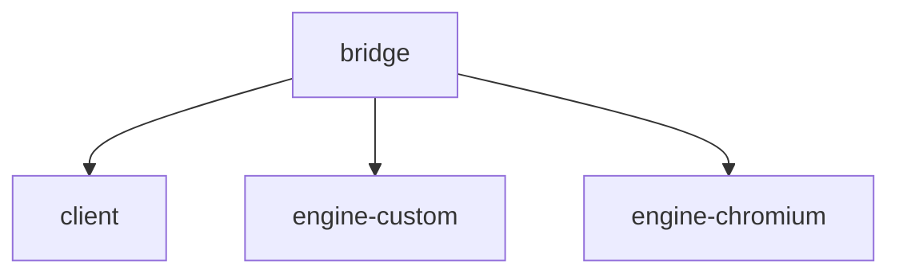

# IDENTITY.md

# bridge repository identity and naming record

This file records the current working naming choice for the split Bridge architecture.

## Chosen family name
- `bridge`

## Chosen repo set
- `bridge/` — workspace/meta repo
- `client/` — application/client repo
- `engine-custom/` — custom engine repo
- `engine-chromium/` — Chromium-backed engine repo

## Why these names

### `bridge`
Chosen as the umbrella/workspace identity because it:
- has personal significance
- is architecturally relevant (bridging app/client and engines)
- works well as a top-level family name

### `client`
Chosen for the middle repo because it is:
- technically true
- broad and flexible
- not tied to a particular platform or narrow browser term
- a reasonable descriptor for the app layer that consumes/coordinates engine backends

### `engine-custom`
Chosen because this repo owns the first-party/custom engine path.

### `engine-chromium`
Chosen because the Chromium-backed path really owns the full Chromium dependency/runtime boundary (including Blink and V8 inside that stack), not just “rendering.”

## Architectural role summary

- `bridge` = workspace/meta repo
- `client` = app/client layer, UX, lifecycle, diagnostics, and engine orchestration
- `engine-custom` = custom engine backend
- `engine-chromium` = Chromium-backed engine backend

## Notes

This naming choice intentionally distinguishes:
- the umbrella/workspace identity (`bridge`)
- the application/client layer (`client`)
- the engine implementations (`engine-*`)

This is more accurate than treating the middle repo as the whole browser or as a mere UI/container layer.
