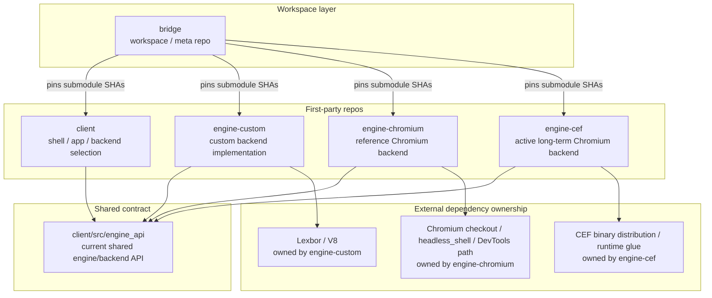
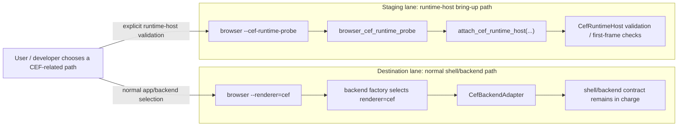
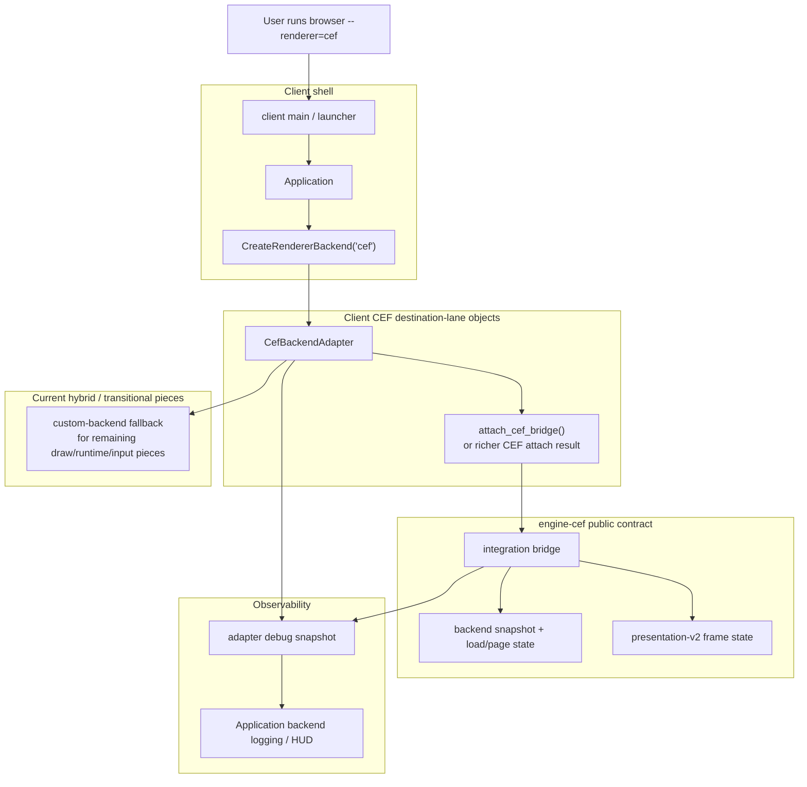
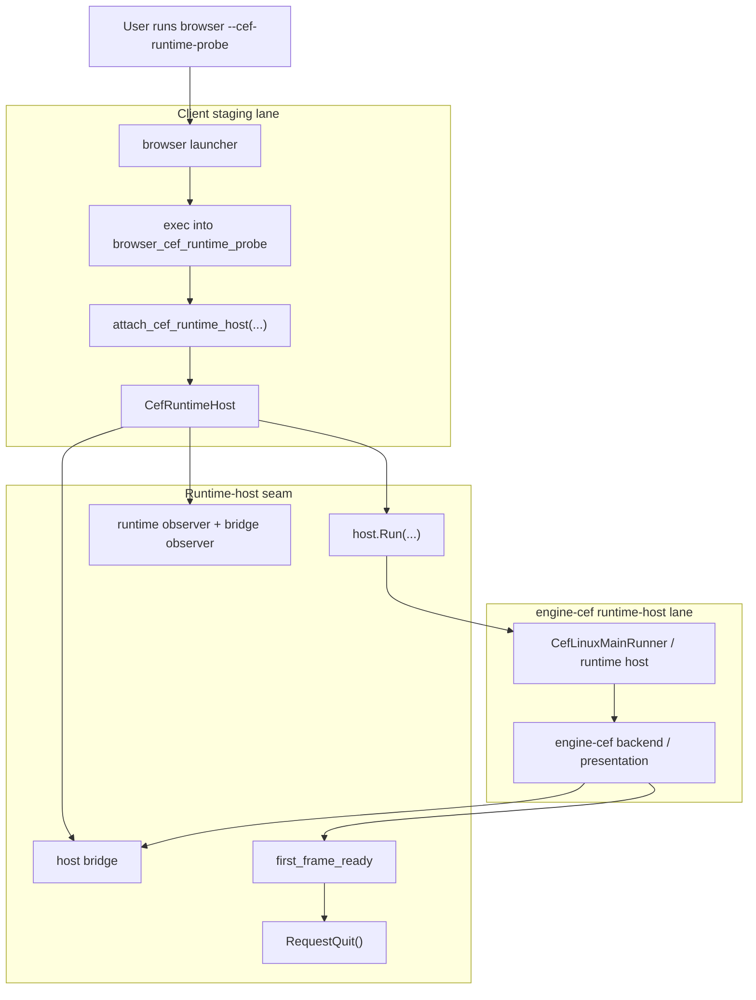
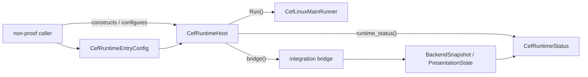
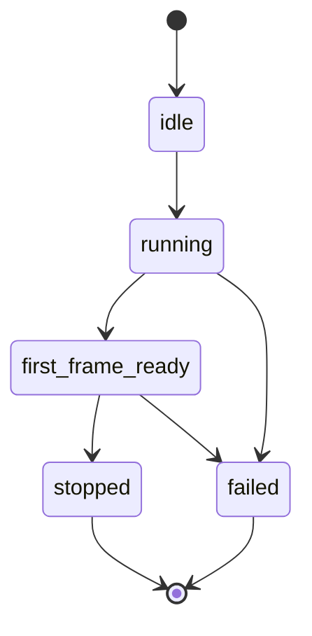
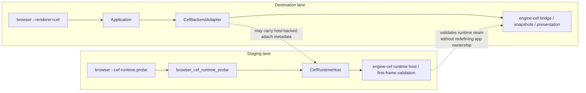
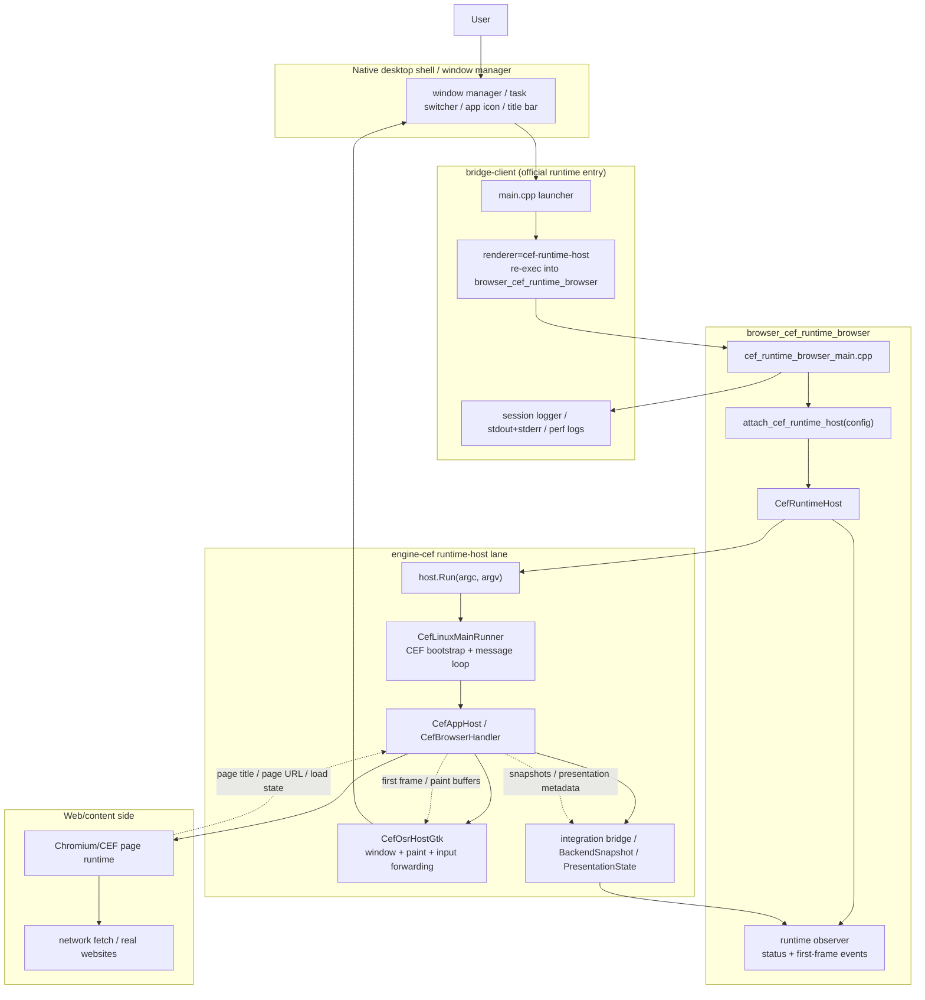
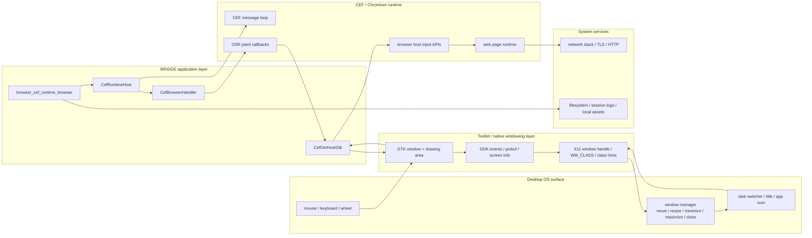

# Current architecture overview

_Date: 2026-04-05_

This document is the current high-level architecture overview for the split Bridge workspace after the CEF pivot.

It is meant to answer four questions quickly:

1. What repos exist and what do they own?
2. What is the long-term destination lane?
3. What is the staging/runtime-host lane?
4. How do the shell, adapter, bridge, runtime host, and engine repos coordinate today?

For more detailed seam documents, also see:
- `../GIT.md`
- `../WORKSPACE.md`
- `../browser/docs/architecture.md`
- `../browser/docs/cef-runtime-lanes.md`
- `../browser/docs/cef-attach-seam.md`
- `../engine-cef/docs/runtime-integration-boundary-v1.md`
- `../engine-cef/docs/client-integration-bridge.md`
- `../engine-cef/docs/presentation-seam-v2.md`

---

## 1. Workspace / repo topology

### Repo roles

- `bridge/`
  - workspace/meta repo
  - submodule pointers
  - root docs, wrappers, integration workflows
- `client/`
  - shell/app repo
  - backend selection
  - backend-facing diagnostics and tests
- `engine-custom/`
  - in-house/custom backend implementation
- `engine-chromium/`
  - older Chromium-backed **reference/demo** backend lane
- `engine-cef/`
  - active long-term Chromium backend target

---

## 2. The two CEF-related lanes

The current architecture intentionally distinguishes two CEF-related lanes.

### Destination lane

This is the long-term architectural destination.

Examples:
- `browser --renderer=cef`
- `CreateRendererBackend("cef")`
- `CefBackendAdapter`

Characteristics:
- the shell stays in charge
- `renderer=cef` remains a backend under the shell/backend contract
- this lane is still hybrid today
- this is the lane that should mature over time

### Staging lane

This is a deliberate runtime-host bring-up/diagnostic lane.

Examples:
- `attach_cef_runtime_host(...)`
- `browser_cef_runtime_probe`
- `browser --cef-runtime-probe`
- `engine_cef_runtime_host_probe`

Characteristics:
- directly exercises `CefRuntimeHost`
- useful for Linux OSR/bootstrap/first-frame validation
- intentionally narrow and opt-in
- should remain distinct from the normal shell/backend path until deeper ownership changes are chosen on purpose

### Core rule

- `--renderer=cef` = destination lane
- `--cef-runtime-probe` = staging lane

The architecture should continue to reinforce that distinction.

---

## 3. Destination lane coordination

This is the current long-term lane: the shell selects a backend, and the CEF path is carried under the backend contract.

### Current truth of the destination lane

Today `renderer=cef` is **not** a fully native CEF-owned browser shell.

It is a hybrid backend path where:
- the shell remains in charge
- the adapter consumes the public `engine-cef` contract
- bridge/presentation/frame/debug metadata can already flow into the shell/backend observability path
- some draw/runtime/input behavior still contains transitional borrowing from the custom backend

That is intentional. The goal is to make the destination lane more truthful over time without pretending the migration is finished.

---

## 4. Staging lane coordination

This is the runtime-host validation lane.

### Current truth of the staging lane

This lane exists to validate:
- runtime bootstrap
- OSR first-frame readiness
- runtime-host lifecycle
- bridge/snapshot observation

It is useful and real, but it is **not** the same thing as saying the normal shell/backend lane is already complete.

---

## 5. Runtime-boundary ownership today

The current runtime boundary is intentionally small.

### Runtime-boundary rules

For now:
- caller owns `CefRuntimeHost`
- caller does **not** own `CefAppHost` directly
- readiness is first-frame based
- `Run(...)` is still blocking
- async runtime-manager ownership is not yet the architecture

That runtime boundary is a staging/runtime-host seam, not yet the final shell/app ownership model.

### Runtime phase model

---

## 6. Current observability flow

One of the important improvements in the current architecture is that richer CEF/debug metadata now reaches the shell-visible path.

```mermaid
flowchart LR
    subgraph ENGINE_STATE["Engine / runtime-derived state"]
        B1["bridge snapshot"]
        B2["presentation metadata"]
        B3["optional host runtime status"]
    end

    subgraph ADAPTER_STATE["Client adapter debug state"]
        A1["frame-source"]
        A2["bridge-presentation"]
        A3["attach-kind / attach-host"]
        A4["attach-runtime phase / error"]
    end

    subgraph APP_STATE["App-visible diagnostics"]
        APPLOG["Application backend logging"]
        HUD["HUD / debug view"]
    end

    USER["developer / operator"]

    ENGINE_STATE --> ADAPTER_STATE --> APP_STATE --> USER
```

Examples of metadata now visible in the destination lane:
- `frame-source ...`
- `bridge-presentation ...`
- `attach-kind ...`
- `attach-host present=...`
- `attach-runtime phase=... saw_first_frame=... exit=...`
- `attach-runtime error=...`

That means the destination lane can get richer and more honest before the project commits to deeper runtime-host ownership changes.

---

## 7. Coordination summary: destination lane vs staging lane

### What this means

- the destination lane is where the long-term architecture should mature
- the staging lane is where runtime-host/bootstrap validation happens
- the two lanes are related, but they should not be collapsed into one thing prematurely

---

## 8. What is long-term destination vs current staging tool?

### Long-term destination

- one shell/app repo
- multiple backend repos
- `renderer=cef` becoming a proper backend under the shell/backend contract
- `engine-cef` carrying the active long-term Chromium integration work

### Current staging tools

- `attach_cef_runtime_host(...)`
- `browser_cef_runtime_probe`
- `browser --cef-runtime-probe`
- `engine_cef_runtime_host_probe`

These are valuable, but they are staging/diagnostic tools, not the final app architecture.

---

## 9. Official browser runtime wireframes

The diagrams above explain the historical split between destination lane and staging lane.

The two diagrams below answer a slightly different question:

- when the **official/main** browser is running today,
- what are the runtime layers inside it,
- and how does it interface with the operating system?

For this section, the official/main browser pairing means:

- `browser --renderer=cef-runtime-host`

That is the current proof/production-direction path for the live interactive browser.

### 9.1 Official browser internal runtime layers

### 9.2 Official browser ↔ operating system interface layers

### Reading these diagrams

The key point is that the official/main browser path today is **not** the old browser-owned shell/chrome loop.

Instead, it is:

- a launcher-level runtime-host browser entry,
- owning the CEF runtime/message loop directly,
- painting through an OSR host window,
- and forwarding input from GTK/GDK into `CefBrowserHost`.

That is why this path now behaves differently from the older/legacy shell-owned route.

---

## 10. What should happen next?

The intended direction from here is:

1. keep strengthening the destination lane (`renderer=cef`) under the shell/backend contract
2. keep the staging lane available for runtime validation and bring-up
3. move more truth/state/ownership into the destination lane only when the seams are ready
4. avoid turning `Application` into a bespoke CEF runtime launcher by default

---

## Plain-English summary

The architecture today is:

- `bridge/` = workspace/meta repo
- `client/` = shell/app repo
- `engine-custom/` = custom backend
- `engine-chromium/` = runnable reference Chromium backend
- `engine-cef/` = active long-term Chromium backend target

And within the client, there are **two different CEF lanes**:

- **destination lane**: `--renderer=cef`
- **staging lane**: `--cef-runtime-probe`

The project should keep making the destination lane stronger while keeping the staging lane useful and separate.
