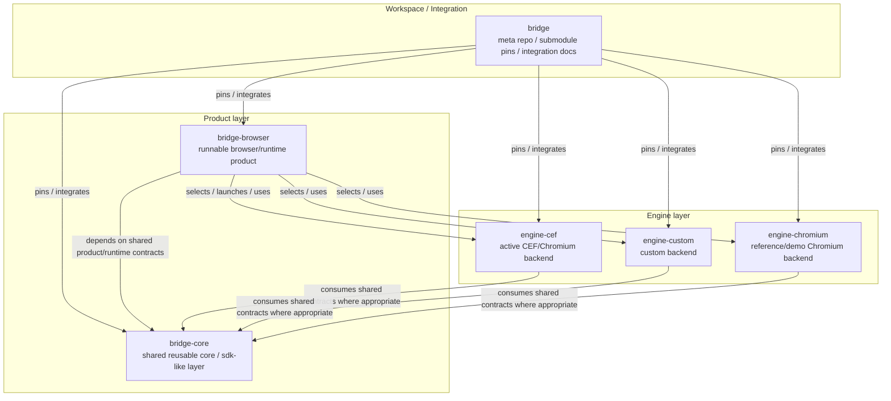
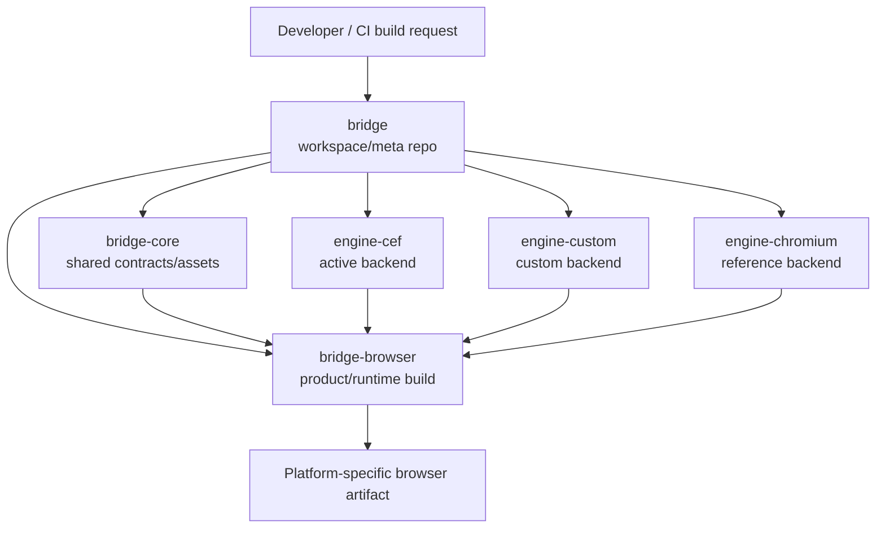
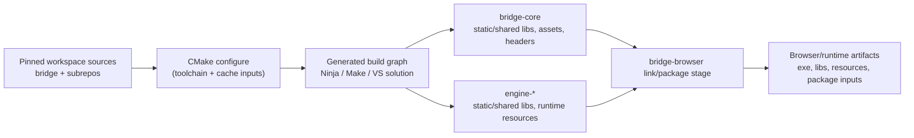
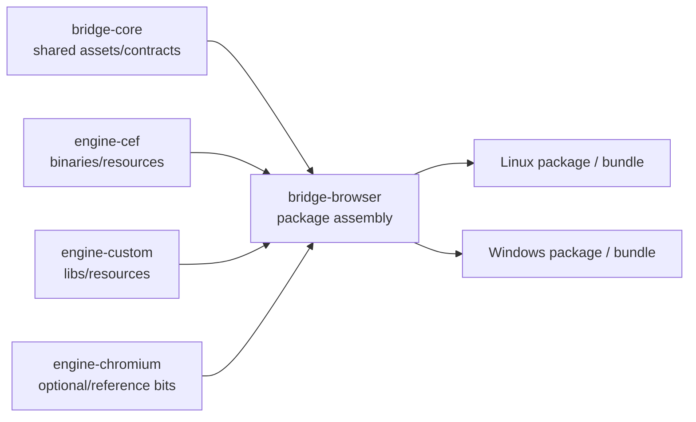
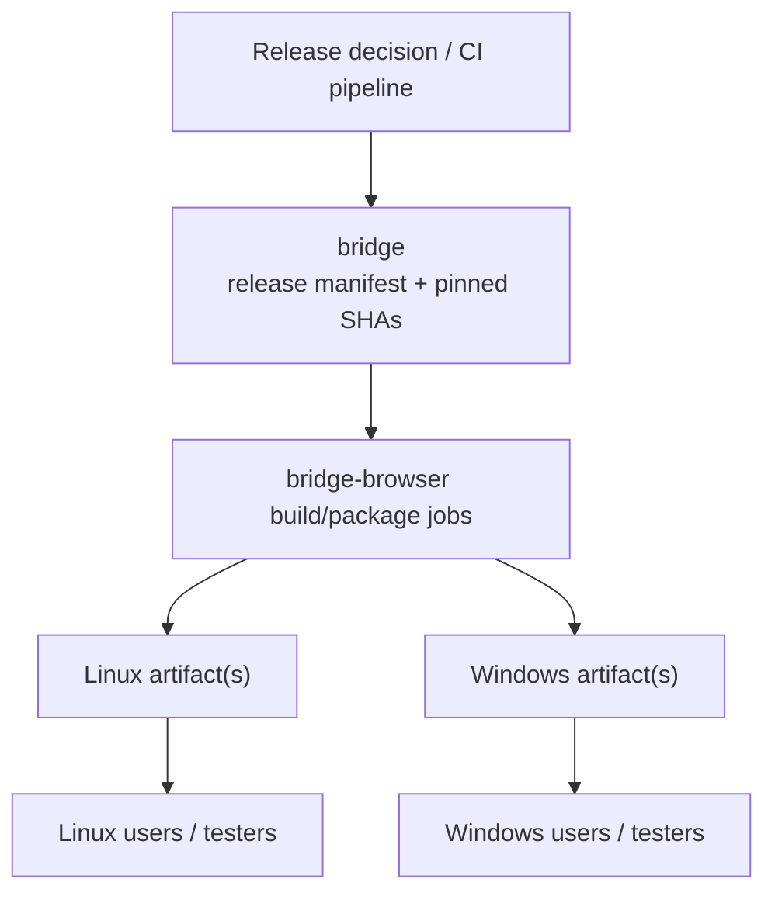

# Planned repository structure — 2026-04-06

This document captures the **preferred** near-to-medium-term repository structure for Bridge based on the current codebase, current workspace split, and the new requirement to support multiple target operating systems without turning Bridge into two separately maintained browser products.

This structure is intended to balance:

- clean architecture
- sane repo count
- support for Windows and Linux targets
- low duplication of product/browser behavior
- tolerable git/submodule overhead

---

# 1. Proposed repository set

## Workspace / product repos
- `bridge`
- `bridge-browser`
- `bridge-core`

## Engine repos
- `engine-cef`
- `engine-custom`
- `engine-chromium`

This is the preferred compromise structure at this stage.
It is intentionally lighter than the earlier “many platform repos” proposal.

---

# 2. High-level model

## Plain-English summary

- `bridge` = workspace/meta/integration repo
- `bridge-browser` = the runnable browser/runtime product repo
- `bridge-core` = shared reusable core / sdk-like layer
- `engine-cef` = active long-term Chromium/CEF backend repo
- `engine-custom` = in-house/custom backend repo
- `engine-chromium` = older Chromium-backed reference/demo repo

The most important architectural idea is:

> one browser product, multiple target platforms, shared core behavior, and backend repos that implement rendering/browser machinery.

---

# 3. Repository relationship diagram



---

# 4. Internal structure concept

This repo plan only works if two repos are internally disciplined:

- `bridge-browser`
- `engine-cef`

Even though they remain single repos, they should not become mixed-platform soup.

## Internal directory philosophy

### `bridge-browser`
Should internally separate:
- shared browser/runtime product code
- Linux-specific runtime/browser app code
- Windows-specific runtime/browser app code

Example conceptual shape:

```text
bridge-browser/
  src/
    core/
    platform/
      linux/
      win/
    launcher/
    workbench/
  packaging/
    linux/
    win/
  tests/
  docs/
```

### `engine-cef`
Should internally separate:
- shared CEF runtime/browser logic
- Linux-specific host/runtime code
- Windows-specific host/runtime code

Example conceptual shape:

```text
engine-cef/
  src/
    core/
    host/
      linux/
      win/
  include/
  tests/
  docs/
```

This lets the project avoid repo-count explosion **without** pretending platform-specific code will stay tiny.

---

# 5. Responsibilities by repository

## 5.1 `bridge`
### Role
Workspace/meta/integration repo.

### Owns
- submodule pointers / pinned SHAs
- cross-repo architecture docs
- migration plans
- workspace scripts
- release/integration manifests
- cross-repo benchmark/readiness docs if they are truly workspace-wide

### Does not own
- significant implementation code
- backend-specific internals
- product runtime implementation details

### Why it still exists
The more Bridge remains a multi-repo workspace, the more useful a thin-but-real integration/meta repo becomes.

---

## 5.2 `bridge-browser`
### Role
The runnable browser/runtime product repo.

This is the thing users effectively run.
It is the app/runtime layer, not the backend implementation layer.

### Owns
- browser/runtime executable entry points
- launcher behavior
- runtime/browser process orchestration
- platform-specific app/runtime glue where needed
- packaging/install/distribution behavior
- workbench/launcher UX if retained at the app level
- platform-specific browser app concerns

### Internally should separate
- shared browser/runtime product code
- platform-specific runtime code

### Example kinds of code that likely belong here
- launch entry points
- browser executable wrappers
- runtime selection logic
- platform-specific profile path/runtime startup behavior
- packaging scripts and installers
- workbench app/window code

### Should not own
- engine-specific rendering/runtime internals
- CEF-specific host implementation details that belong to `engine-cef`
- shared reusable product contracts that should be consumed by engines and runtime alike

---

## 5.3 `bridge-core`
### Role
Shared reusable core / sdk-like layer.

This is not a public SDK in the polished vendor sense.
It is the shared reusable layer that defines durable Bridge-level contracts, shared product behavior, and assets that should not be reimplemented in the runtime or engines.

### Owns
- shared engine/backend contracts
- shared product/browser models/state
- shared browser/product behavior that should not vary by platform
- shared assets such as BRIDGE Home
- shared benchmark definitions
- shared readiness/acceptance behavior definitions
- shared browser action/shortcut semantics where they can be expressed backend-neutrally
- potentially shared navigation/controller logic

### Example kinds of code that likely belong here
- current `engine_api/` seam
- shared navigation/controller logic
- shared browser action model
- shared page-kind/special-page model if lifted out of backend-specific code
- BRIDGE Home asset/content
- benchmark site definitions and product-wide readiness docs

### Should not own
- GTK/X11 host code
- Win32 host code
- packaging/installers
- app entrypoints
- backend-specific runtime host implementations

### Why it matters
`bridge-core` is where Bridge defines:
- what the product means
- what contracts engines/runtimes implement
- what should behave the same on Linux and Windows

---

## 5.4 `engine-cef`
### Role
Active long-term Chromium/CEF backend repo.

### Owns
- CEF integration bridge
- runtime-host machinery
- CEF-specific browser/runtime implementation logic
- popup/new-tab behavior at the backend integration layer
- tab/runtime implementation details that are CEF-specific
- CEF-specific host/runtime logic
- CEF/Chromium dependency/bootstrap ownership

### Internally should separate
- shared CEF runtime/browser logic
- Linux-specific CEF host/runtime code
- future Windows-specific CEF host/runtime code

### Example conceptual internal modules
- `src/core/`
  - shared runtime/browser/CEF logic
- `src/host/linux/`
  - GTK/X11 host implementation
- `src/host/win/`
  - future Windows host implementation

### Should not own
- shared product assets/content that are not CEF-specific
- workspace integration responsibilities
- app packaging/installers
- product identity decisions that belong to the browser/runtime layer or `bridge-core`

---

## 5.5 `engine-custom`
### Role
Custom backend repo.

### Owns
- parser/style/layout/paint/js internals
- custom backend implementation
- custom dependency ownership

### Notes
This repo should remain engine-specific and stop leaking implementation internals directly into the runtime/browser core over time.

---

## 5.6 `engine-chromium`
### Role
Reference/demo Chromium lane.

### Owns
- older Chromium-backed reference/demo backend work
- comparison/debugging lane
- experimental/reference integration paths

### Notes
This repo is optional in the long-term sense, but if retained it should remain clearly framed as a reference/demo lane rather than the active target architecture.

---

# 6. Responsibility matrix

## Product/runtime responsibilities
These belong primarily to `bridge-browser` and/or `bridge-core`:

- what the user launches
- runtime/browser startup flow
- product identity and composition
- BRIDGE Home content and intent
- browser-level feature expectations
- benchmark definitions
- alpha-readiness expectations
- packaging and distribution

## Shared core responsibilities
These belong primarily to `bridge-core`:

- shared contracts/interfaces
- shared browser/product models
- durable reusable semantics
- assets that define product behavior across targets

## Engine responsibilities
These belong to the `engine-*` repos:

- backend implementation
- backend-specific runtime details
- backend-specific dependency ownership
- backend-specific host/runtime integration
- backend-specific frame/presentation/runtime behavior

---

# 7. Module/coupling guidance

## Good coupling
- `bridge-browser` depends on `bridge-core`
- `bridge-browser` depends on engine repos through defined seams
- engine repos consume shared contracts from `bridge-core` where appropriate

## Bad coupling to avoid
- `bridge-browser` directly compiling engine implementation sources as a long-term norm
- `engine-cef` owning product assets/content decisions that are not CEF-specific
- `bridge-core` becoming a dumping ground for anything “shared-ish” without discipline
- platform-specific code being scattered across runtime and engine repos without clear boundaries

---

# 8. Why this structure is preferred

## 8.1 Fewer repos than the maximal split
This avoids creating separate repos for every platform variant immediately.

## 8.2 Cleaner than the current client/core naming
`bridge-browser` and `bridge-core` are easier to reason about than `client` vs `client-core`.

## 8.3 Supports multiple OS targets without duplicating the product
There is one browser/runtime product repo, not separate Linux/Windows browser products.

## 8.4 Preserves future optionality
If platform-specific code later becomes too large inside `bridge-browser` or `engine-cef`, those repos can still be split further later.
This structure does not block a later extraction.

---

# 9. Proposed migration plan

## Phase 0 — Freeze current architecture truths
### Checklist
- [ ] keep current architecture docs updated
- [ ] explicitly record Windows support as a first-class requirement
- [ ] record the chosen preferred repo plan in docs

### Deliverable
- this document and related planning docs

---

## Phase 1 — Reframe `client` as `bridge-browser`
### Checklist
- [ ] decide whether to rename the repo immediately or keep the current name temporarily and change its documented role first
- [ ] define `bridge-browser` as the runtime/product repo
- [ ] identify what inside the current `client/` repo is truly runtime/app/platform code vs what is shared core material

### Immediate likely candidates to keep in `bridge-browser`
- executable entrypoints
- launcher/runtime orchestration
- workbench/runtime UI if app-level
- platform/browser startup logic
- packaging/install concerns

---

## Phase 2 — Extract `bridge-core`
### Checklist
- [ ] create `bridge-core`
- [ ] move shared contracts first
- [ ] move shared product assets/content next
- [ ] move shared browser/product behavior that does not belong to runtime entrypoints or engine internals

### Likely first candidates to move
- current shared engine/backend contract layer
- shared navigation/controller logic
- BRIDGE Home asset/content
- benchmark site definitions and shared readiness docs
- shared browser action/shortcut semantics if expressed backend-neutrally

### Important cleanup task
- [ ] stop the current transitional pattern where client-core directly compiles `engine-custom` implementation sources

---

## Phase 3 — Internally split `bridge-browser`
### Checklist
- [ ] create internal structure such as:
  - `src/core/`
  - `src/platform/linux/`
  - `src/platform/win/`
- [ ] move Linux-specific runtime code into Linux-specific directories
- [ ] prepare a future Windows-specific directory even if initially sparse

### Goal
Reduce platform entanglement without creating more repos yet.

---

## Phase 4 — Internally split `engine-cef`
### Checklist
- [ ] create internal structure such as:
  - `src/core/`
  - `src/host/linux/`
  - `src/host/win/`
- [ ] move GTK/X11 host code into `host/linux`
- [ ] identify shared runtime/browser code that should remain in `core`
- [ ] prepare a future Windows host directory structure

### Goal
Make Windows host support possible without immediately creating a separate `engine-cef-win` repo.

---

## Phase 5 — Reduce cross-layer leaks
### Checklist
- [ ] ensure product assets/content are owned by `bridge-core` or `bridge-browser`, not engine repos
- [ ] ensure engine repos depend on shared contracts, not on random client/runtime internals
- [ ] ensure runtime/browser repos do not keep pulling engine implementation sources directly as transitional hacks

---

## Phase 6 — Add Windows implementation work from the new seams
### Checklist
- [ ] add Windows-specific structure under `bridge-browser`
- [ ] add Windows host structure under `engine-cef`
- [ ] implement Windows runtime-host path against the same shared runtime/browser/product semantics
- [ ] keep benchmark/readiness expectations shared across OS targets

---

# 10. Different responsibilities each repo will have

## `bridge`
- workspace coordination
- submodule/version pinning
- cross-repo docs
- release/integration coordination

## `bridge-browser`
- runnable browser product
- launch/runtime orchestration
- platform-specific browser/runtime app glue
- packaging/distribution

## `bridge-core`
- shared reusable contracts
- shared product/browser behavior
- shared assets/content
- shared benchmark/readiness definitions

## `engine-cef`
- active CEF/Chromium backend implementation
- CEF runtime/browser machinery
- CEF host implementations by platform

## `engine-custom`
- custom backend implementation
- custom dependency/runtime internals

## `engine-chromium`
- Chromium reference/demo lane
- comparison/debugging path

---

# 11. Build / package / deployment paradigm

This section describes how the proposed repos should work together when Bridge is built, packaged, and deployed.

## 11.1 Build paradigm

The preferred build model is:

- `bridge` remains the top-level workspace/integration repo
- `bridge-browser` is the main app/runtime build target repo
- `bridge-browser` depends on:
  - `bridge-core`
  - one or more engine repos
- `bridge-browser` assembles the runnable browser product for a target platform

### High-level build flow



### Toolchain-oriented build model

At a practical level, the build should behave roughly like this:

1. a developer or CI job checks out the `bridge` workspace at a pinned set of repo SHAs
2. the target platform/toolchain is selected
   - Linux example:
     - GCC or Clang
     - CMake + Ninja/Make
     - GTK/X11 development packages for the current Linux CEF host path
   - Windows example:
     - MSVC or Clang-cl
     - CMake + Ninja or Visual Studio generator
     - Win32/Windows SDK dependencies for the Windows browser/runtime target
3. `bridge-browser` acts as the main product build entry point
4. `bridge-browser` consumes headers/libraries/assets from:
   - `bridge-core`
   - `engine-cef`
   - `engine-custom`
   - `engine-chromium` (if enabled)
5. CMake config produces platform-specific build graphs and output directories
6. final browser/runtime artifacts are emitted for the selected target OS/configuration

### Suggested build pipeline shape



### Typical CMake inputs

Examples of the kinds of inputs the build should standardize around:

- workspace source paths / submodule checkout state
- target OS
- compiler/toolchain selection
- build type (`Debug`, `RelWithDebInfo`, `Release`)
- enabled engines/backends
- external dependency roots where required
  - example: CEF distribution root
- packaging toggles
- optional benchmark/test targets

### Typical CMake outputs

Examples of the kinds of outputs the build should emit:

- browser/runtime executables
- helper/probe binaries where relevant
- static/shared libraries for shared core and engines
- copied runtime resources
- packaging-ready directory layout
- test binaries
- optional benchmark binaries

### Practical meaning

- shared behavior/assets/contracts come from `bridge-core`
- backend implementations come from `engine-*`
- final executable products are assembled in `bridge-browser`
- `bridge` pins a coherent workspace state and can own cross-repo build scripts/manifests
- CMake should remain the main cross-platform orchestration layer unless there is a compelling reason to introduce another build system

---

## 11.2 Packaging paradigm

Packaging should happen at the `bridge-browser` layer, because that is the actual product/runtime target repo.

### Packaging responsibilities

#### `bridge-browser`
Should own:
- executable bundling
- platform-specific runtime layout
- installable package definitions
- browser assets that need to ship in the final app bundle
- packaging scripts/workflows for Linux and Windows

#### `bridge-core`
Should contribute:
- shared assets/content
- shared config defaults
- shared benchmark/readiness content if shipped or referenced

#### `engine-*`
Should contribute:
- backend binaries/libraries/resources
- engine-specific runtime dependencies
- engine-specific packaging notes/scripts only when needed to support the browser package

### Packaging flow



### Practical meaning

- package assembly should not be owned by engine repos
- package assembly should not be owned by the meta repo except at a very high orchestration level
- the browser/runtime repo is where “Bridge as a distributable application” becomes real

---

## 11.3 Deployment paradigm

Deployment should be treated as:

- per-platform product delivery from `bridge-browser`
- backed by pinned workspace versions from `bridge`

### Deployment responsibilities by repo

#### `bridge`
- defines coherent multi-repo version sets
- can own release manifests / release notes / integration docs
- can orchestrate CI matrices across repos

#### `bridge-browser`
- produces the deployable artifacts
- owns platform-facing deployment steps
- documents how end users run/install the product

#### `bridge-core`
- should not be deployed as the user-facing product by itself
- is a build/runtime dependency for the final app

#### `engine-*`
- should not generally be deployed standalone as “the product”
- contribute required runtime pieces to the final packaged browser

### Deployment flow



### Recommended principle

Treat `bridge-browser` as the deployable product repo and `bridge` as the release-coordination repo.
That keeps deployment ownership clear.

---

# 12. Key dependencies by repository

This section outlines the most important dependency categories for each repo.
It is not meant to be an exhaustive package lock list; it is a structural dependency map.

## 12.1 `bridge`
### Key dependencies
- git/submodule references to all first-party repos
- workspace scripts
- cross-repo CI/release logic
- cross-repo documentation

### Dependency role
- orchestration and integration dependency owner
- not a primary implementation dependency owner

---

## 12.2 `bridge-browser`
### Key dependencies
- `bridge-core`
- `engine-cef`
- `engine-custom`
- `engine-chromium` (if reference/demo lane remains enabled)
- platform-specific desktop/runtime libraries as needed
- packaging toolchain per target OS

### Likely dependency categories
- launcher/runtime entrypoint dependencies
- platform app/window/event-loop libraries
- package/bundle tooling
- browser product assets/resources

### Dependency role
- final app assembly point
- product/runtime dependency owner

---

## 12.3 `bridge-core`
### Key dependencies
- standard library/shared utility dependencies only where possible
- shared asset/resource dependencies
- contract/model/test dependencies

### Desired dependency profile
- as light and stable as possible
- avoid platform-specific GUI/windowing dependencies
- avoid engine-specific implementation dependencies

### Dependency role
- shared reusable foundation
- contract/model/asset dependency owner

---

## 12.4 `engine-cef`
### Key dependencies
- CEF binary distribution / CEF SDK
- Chromium/CEF runtime resources
- native platform libraries for host integration
  - currently GTK/GDK/X11 on Linux
  - future Win32/Windows UI/runtime libraries on Windows
- libcef / libcef_dll_wrapper and related CEF glue

### Dependency role
- active Chromium/CEF backend dependency owner
- native host/runtime integration dependency owner for the CEF lane

---

## 12.5 `engine-custom`
### Key dependencies
- Lexbor
- optional V8 integration
- text/rendering deps such as Freetype/HarfBuzz where enabled
- image/network deps such as PNG/CURL where enabled

### Dependency role
- custom engine dependency owner
- parser/layout/style/js/paint stack dependency owner

---

## 12.6 `engine-chromium`
### Key dependencies
- Chromium checkout / Chromium integration artifacts
- CURL/PNG and other reference-lane support deps where enabled
- reference/demo backend integration tooling

### Dependency role
- reference Chromium lane dependency owner
- comparison/demo dependency owner

---

# 13. Final recommendation

This is the preferred planned structure because it gives Bridge:

- a clear product/runtime repo (`bridge-browser`)
- a clear shared reusable core (`bridge-core`)
- a manageable total repo count
- a realistic path to Windows and Linux support
- room to isolate platform-specific code internally without immediately exploding into many new platform repos

The key discipline required to make this work is:

- do not let `bridge-browser` become a random mix of shared core and platform junk
- do not let `engine-cef` become a random mix of reusable CEF logic and unstructured platform host code
- create internal core/platform boundaries early, even if repo extraction comes later

That is what keeps this lighter repo plan viable.
