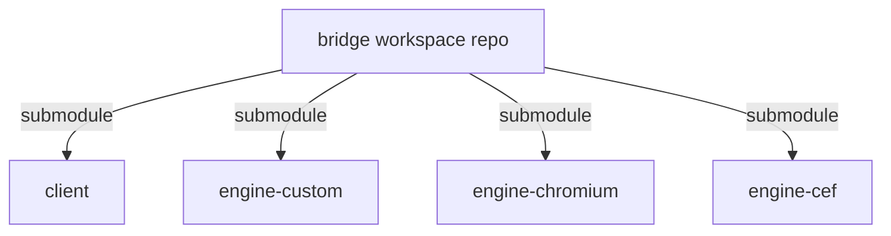

# refactor.md

# bridge refactor plan: finalize the split and clean up the boundaries

This document captures the current execution plan for getting from the transitional split workspace to a clean multi-repo architecture.

## Current repo set

- `bridge/` — workspace/meta repo
- `client/` — app/client repo
- `engine-custom/` — custom engine repo
- `engine-chromium/` — Chromium-backed **reference** engine repo
- `engine-cef/` — active long-term Chromium backend target repo

## End-state model

## Near-term strategic direction

- keep the current tagged `engine-chromium` path runnable as a reference/demo backend, but stop treating it as the active long-term target
- make `engine-cef` the active long-term Chromium backend target
- keep the custom engine on the roadmap as a strategic asset and reference backend
- continue hardening the client/backend contract so both the reference backend and the new CEF backend can coexist during migration

## Immediate next steps from the current split state

### Phase 1 — keep the 5-repo workspace honest
1. keep `bridge/` as a true submodule-based workspace/meta repo
2. track only workspace docs/wrappers there
3. keep child-repo ownership and docs aligned with the current repo set (`client`, `engine-custom`, `engine-chromium`, `engine-cef`)
4. prevent root-level wrappers/docs from drifting back toward an implementation-monorepo mental model

### Phase 2 — improve DX
1. add root-level targeted build/test wrappers
2. add explicit workspace bootstrap/update scripts for submodules
3. add `engine-custom/config/v8.env` to mirror Chromium pinning discipline
4. improve repo-local build helper symmetry across `client`, `engine-custom`, `engine-chromium`, and `engine-cef`

### Phase 3 — finish technical cleanup
1. remove `client` direct compilation of engine-owned custom sources
2. remove `engine-chromium` dependency on `engine-custom` internals where it remains transitional
3. formalize/export the engine API contract currently living in `client`

### Phase 4 — continue Chromium backend integration with the right lane ownership
1. keep the Chromium checkout/build stable in `engine-chromium` as a runnable reference/demo backend
2. keep `engine-cef` as the active long-term Chromium backend target
3. continue hardening the client/backend interface so both the reference lane and the CEF lane can coexist during migration
4. avoid re-centering the long-term plan on the old `headless_shell`/DevTools/screenshot architecture

## Remaining technical impurities to fix

### A. `client` still compiles some custom-engine sources directly
This was a migration patch, not the final architecture.

Desired end state:
- `engine-custom` exports proper library targets
- `client` links those targets
- `client` stops compiling engine-owned `.cpp` files directly

### B. `engine-chromium` still has transitional dependency edges
Those need to be reduced so the Chromium engine is not leaning on custom-engine internals unnecessarily.

Desired end state:
- `engine-chromium` is independent of `engine-custom`
- any truly shared support code lives in a neutral shared layer or is duplicated intentionally where tiny

### C. Engine API is still physically in `client`
That is acceptable for now, but it should be treated like a public/exportable contract and possibly extracted later.

## DX goals

The workspace should support clear targeted commands such as:
- `./build.sh off`
- `./build.sh on`
- future targeted engine-specific wrappers
- `./scripts/status.sh`
- focused smoke-test wrappers

The root workspace repo should remain orchestration-only, but it should make cross-repo work easy.

## CI/CD goals

### Per-repo CI
- `client` CI
- `engine-custom` CI
- `engine-chromium` CI
- `engine-cef` CI

### Workspace integration CI
- check out pinned child SHAs via submodules
- run cross-repo build/test validation
- capture known-good integration states

## Summary

The main unfinished work is no longer “create the split.”
That exists.

The remaining work is to:
- keep the Git/submodule topology honest and low-noise
- harden dependency ownership
- remove transitional compile/link leaks
- improve workspace DX
- keep the custom engine alive while the CEF Chromium lane matures and the older Chromium lane remains a documented reference backend
