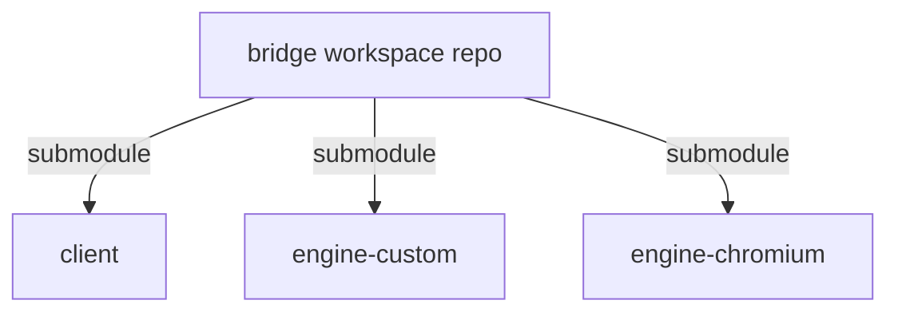

# refactor.md

# bridge refactor plan: finalize the split and clean up the boundaries

This document captures the current execution plan for getting from the transitional split workspace to a clean multi-repo architecture.

## Current repo set

- `bridge/` — workspace/meta repo
- `client/` — app/client repo
- `engine-custom/` — custom engine repo
- `engine-chromium/` — Chromium-backed engine repo

## End-state model

## Near-term strategic direction

- keep both engines
- treat Chromium as the current practical focus
- keep the custom engine on the roadmap as a strategic asset and reference backend
- continue hardening the client/engine contract

## Immediate next steps once remotes exist

### Phase 1 — make the 4 repos real
1. add real remotes to `client`, `engine-custom`, and `engine-chromium`
2. push each child repo
3. configure `bridge/` as a true submodule-based workspace/meta repo
4. track only workspace docs/wrappers there

### Phase 2 — improve DX
1. add root-level targeted build/test wrappers
2. add explicit workspace bootstrap/update scripts for submodules
3. add `engine-custom/config/v8.env` to mirror Chromium pinning discipline
4. improve repo-local build helper symmetry across `client`, `engine-custom`, and `engine-chromium`

### Phase 3 — finish technical cleanup
1. remove `client` direct compilation of engine-owned custom sources
2. remove `engine-chromium` dependency on `engine-custom` internals where it remains transitional
3. formalize/export the engine API contract currently living in `client`

### Phase 4 — continue Chromium engine integration
1. keep the Chromium checkout/build stable in `engine-chromium`
2. validate and pin the first known-good Chromium revision
3. bridge the built Chromium path back into the client/engine interface
4. keep moving toward a real Chromium-backed engine implementation

## Remaining technical impurities to fix

### A. `client` still compiles some custom-engine sources directly
This was a migration patch, not the final architecture.

Desired end state:
- `engine-custom` exports proper library targets
- `client` links those targets
- `client` stops compiling engine-owned `.cpp` files directly

### B. `engine-chromium` still has transitional dependency edges
Those need to be reduced so the Chromium engine is not leaning on custom-engine internals unnecessarily.

Desired end state:
- `engine-chromium` is independent of `engine-custom`
- any truly shared support code lives in a neutral shared layer or is duplicated intentionally where tiny

### C. Engine API is still physically in `client`
That is acceptable for now, but it should be treated like a public/exportable contract and possibly extracted later.

## DX goals

The workspace should support clear targeted commands such as:
- `./build.sh off`
- `./build.sh on`
- future targeted engine-specific wrappers
- `./scripts/status.sh`
- focused smoke-test wrappers

The root workspace repo should remain orchestration-only, but it should make cross-repo work easy.

## CI/CD goals

### Per-repo CI
- `client` CI
- `engine-custom` CI
- `engine-chromium` CI

### Workspace integration CI
- check out pinned child SHAs via submodules
- run cross-repo build/test validation
- capture known-good integration states

## Summary

The main unfinished work is no longer “create the split.”
That exists.

The remaining work is to:
- formalize the Git/submodule topology
- harden dependency ownership
- remove transitional compile/link leaks
- improve workspace DX
- continue the Chromium engine bring-up while keeping the custom engine alive
